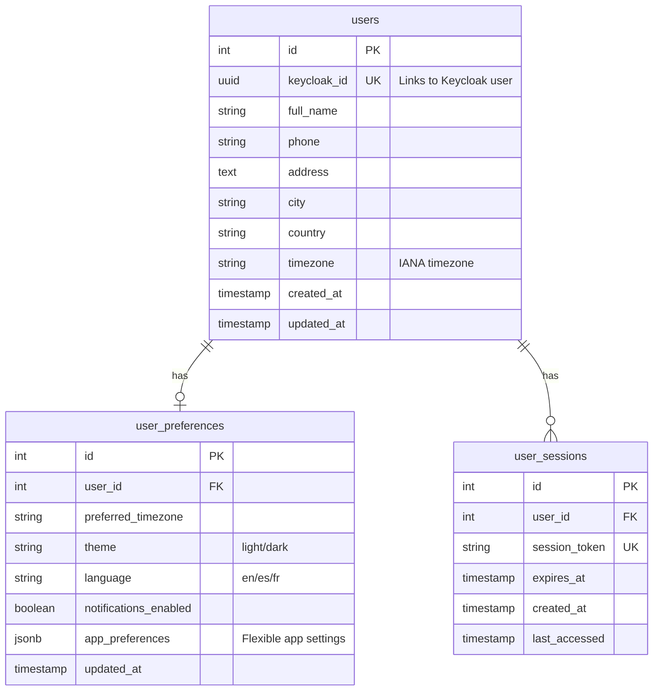

# 🗄️ Database Schema Documentation

This document describes the database structure for the User Authentication BFF template, designed to be minimal yet highly extensible.

**🎉 UPDATED**: This schema has been cleaned and simplified to focus purely on authentication and user management, removing all astrology-specific features.

## 🎯 Design Philosophy

- **Minimal Core**: Essential fields only, avoiding over-engineering
- **Keycloak Integration**: Authentication handled by Keycloak, profiles stored locally
- **Extensible**: Easy to add new fields and relationships
- **JSONB Flexibility**: Use PostgreSQL JSONB for app-specific data
- **Timezone Aware**: All timestamps include timezone information
- **Clean Template**: No domain-specific code, ready for any application

## 📊 Current Database Schema

### Core Tables Overview



## 📋 Detailed Table Specifications

### 1. `users` - Core User Profiles

**Purpose**: Store user profile information linked to Keycloak accounts.

| Column | Type | Constraints | Description |
|--------|------|-------------|-------------|
| `id` | SERIAL | PRIMARY KEY | Auto-incrementing internal ID |
| `keycloak_id` | UUID | UNIQUE, NOT NULL | Foreign key to Keycloak user ID |
| `full_name` | VARCHAR(255) | - | User's display name |
| `phone` | VARCHAR(50) | - | Contact phone number |
| `address` | TEXT | - | Street address |
| `city` | VARCHAR(255) | - | City name |
| `country` | VARCHAR(255) | - | Country name |
| `timezone` | VARCHAR(100) | - | IANA timezone identifier |
| `created_at` | TIMESTAMP WITH TIME ZONE | DEFAULT NOW() | Record creation time |
| `updated_at` | TIMESTAMP WITH TIME ZONE | AUTO-UPDATE | Last modification time |

**Key Design Decisions**:
- ✅ `keycloak_id` as UUID for direct Keycloak integration
- ✅ Basic contact information without over-specification
- ✅ Flexible address fields (not normalized for simplicity)
- ✅ IANA timezone support for global applications

**Indexes**:
```sql
CREATE INDEX idx_users_keycloak_id ON users(keycloak_id);
```

### 2. `user_preferences` - Application Settings

**Purpose**: Store user preferences and app-specific configuration.

| Column | Type | Constraints | Description |
|--------|------|-------------|-------------|
| `id` | SERIAL | PRIMARY KEY | Auto-incrementing ID |
| `user_id` | INTEGER | FK to users(id), UNIQUE | One-to-one with users |
| `preferred_timezone` | VARCHAR(100) | - | Override user's default timezone |
| `theme` | VARCHAR(50) | DEFAULT 'light' | UI theme preference |
| `language` | VARCHAR(10) | DEFAULT 'en' | Language preference |
| `notifications_enabled` | BOOLEAN | DEFAULT true | Global notification setting |
| `app_preferences` | JSONB | - | **Extensible app-specific settings** |
| `updated_at` | TIMESTAMP WITH TIME ZONE | AUTO-UPDATE | Last modification time |

**JSONB Examples**:
```json
{
  "dashboard": {
    "layout": "grid",
    "widgets": ["weather", "calendar", "stats"]
  },
  "notifications": {
    "email": true,
    "push": false,
    "frequency": "daily"
  },
  "ui": {
    "sidebar_collapsed": false,
    "show_tooltips": true
  }
}
```

**Indexes**:
```sql
CREATE INDEX idx_user_preferences_user_id ON user_preferences(user_id);
```

### 3. `user_sessions` - Session Management

**Purpose**: Track and manage user sessions (optional, for enhanced security).

| Column | Type | Constraints | Description |
|--------|------|-------------|-------------|
| `id` | SERIAL | PRIMARY KEY | Auto-incrementing ID |
| `user_id` | INTEGER | FK to users(id) | Session owner |
| `session_token` | VARCHAR(255) | UNIQUE, NOT NULL | Session identifier |
| `expires_at` | TIMESTAMP WITH TIME ZONE | NOT NULL | Session expiration |
| `created_at` | TIMESTAMP WITH TIME ZONE | DEFAULT NOW() | Session start time |
| `last_accessed` | TIMESTAMP WITH TIME ZONE | DEFAULT NOW() | Last activity time |

**Use Cases**:
- Track active sessions per user
- Implement session limits
- Session cleanup/logout
- Security monitoring

**Indexes**:
```sql
CREATE INDEX idx_user_sessions_token ON user_sessions(session_token);
CREATE INDEX idx_user_sessions_user_id ON user_sessions(user_id);
```

## 🔧 Extension Patterns

### Adding Simple Fields

**For basic profile fields**, add directly to the `users` table:

```sql
-- Example: Add LinkedIn profile
ALTER TABLE users ADD COLUMN linkedin_url VARCHAR(255);
```

Update the corresponding Pydantic models:
```python
class UserProfileCreate(BaseModel):
    # ... existing fields ...
    linkedin_url: Optional[str] = None
```

### Adding Complex Data

**For complex or frequently changing data**, use JSONB in `user_preferences`:

```python
# Store complex preferences
user.preferences.app_preferences = {
    "social_links": {
        "linkedin": "https://linkedin.com/in/user",
        "github": "https://github.com/user",
        "website": "https://userwebsite.com"
    },
    "privacy": {
        "show_email": false,
        "show_phone": true,
        "searchable": true
    }
}
```

### Adding Related Tables

**For one-to-many relationships**, create new tables:

```sql
-- Example: User addresses (multiple addresses per user)
CREATE TABLE user_addresses (
    id SERIAL PRIMARY KEY,
    user_id INTEGER REFERENCES users(id) ON DELETE CASCADE,
    address_type VARCHAR(50) NOT NULL, -- 'home', 'work', 'billing'
    street_address TEXT,
    city VARCHAR(255),
    postal_code VARCHAR(20),
    country VARCHAR(255),
    is_default BOOLEAN DEFAULT false,
    created_at TIMESTAMP WITH TIME ZONE DEFAULT CURRENT_TIMESTAMP
);
```

## 🚀 Common Extension Examples

### 1. Multi-Language Support

```sql
-- Add language preferences
ALTER TABLE user_preferences 
ADD COLUMN date_format VARCHAR(20) DEFAULT 'YYYY-MM-DD',
ADD COLUMN time_format VARCHAR(10) DEFAULT '24h',
ADD COLUMN currency VARCHAR(3) DEFAULT 'USD';
```

### 2. Organization/Team Support

```sql
-- Add organization membership
CREATE TABLE organizations (
    id SERIAL PRIMARY KEY,
    name VARCHAR(255) NOT NULL,
    slug VARCHAR(100) UNIQUE NOT NULL,
    created_at TIMESTAMP WITH TIME ZONE DEFAULT CURRENT_TIMESTAMP
);

CREATE TABLE user_organizations (
    user_id INTEGER REFERENCES users(id) ON DELETE CASCADE,
    organization_id INTEGER REFERENCES organizations(id) ON DELETE CASCADE,
    role VARCHAR(50) DEFAULT 'member', -- 'owner', 'admin', 'member'
    joined_at TIMESTAMP WITH TIME ZONE DEFAULT CURRENT_TIMESTAMP,
    PRIMARY KEY (user_id, organization_id)
);
```

### 3. Activity Logging

```sql
-- Track user activities
CREATE TABLE user_activities (
    id SERIAL PRIMARY KEY,
    user_id INTEGER REFERENCES users(id) ON DELETE CASCADE,
    activity_type VARCHAR(100) NOT NULL, -- 'login', 'profile_update', etc.
    details JSONB, -- Flexible activity details
    ip_address INET,
    user_agent TEXT,
    created_at TIMESTAMP WITH TIME ZONE DEFAULT CURRENT_TIMESTAMP
);
```

### 4. File Attachments

```sql
-- User file attachments (avatars, documents)
CREATE TABLE user_files (
    id SERIAL PRIMARY KEY,
    user_id INTEGER REFERENCES users(id) ON DELETE CASCADE,
    file_type VARCHAR(50) NOT NULL, -- 'avatar', 'document', 'certificate'
    file_name VARCHAR(255) NOT NULL,
    file_size INTEGER,
    mime_type VARCHAR(100),
    storage_path TEXT NOT NULL, -- S3 key or local path
    created_at TIMESTAMP WITH TIME ZONE DEFAULT CURRENT_TIMESTAMP
);
```

## 🛠️ Database Utilities

### Auto-Update Timestamps

The schema includes automatic `updated_at` timestamp management:

```sql
-- Function to update timestamps
CREATE OR REPLACE FUNCTION update_updated_at_column()
RETURNS TRIGGER AS $$
BEGIN
    NEW.updated_at = CURRENT_TIMESTAMP;
    RETURN NEW;
END;
$$ language 'plpgsql';

-- Apply to relevant tables
CREATE TRIGGER update_users_updated_at 
    BEFORE UPDATE ON users
    FOR EACH ROW EXECUTE FUNCTION update_updated_at_column();
```

### JSONB Queries

Query app preferences efficiently:

```sql
-- Find users with dark theme
SELECT * FROM user_preferences 
WHERE app_preferences->>'theme' = 'dark';

-- Find users with email notifications enabled
SELECT * FROM user_preferences 
WHERE (app_preferences->'notifications'->>'email')::boolean = true;

-- Update nested JSONB values
UPDATE user_preferences 
SET app_preferences = jsonb_set(
    app_preferences, 
    '{dashboard,layout}', 
    '"list"'
) 
WHERE user_id = 1;
```

## 📈 Performance Considerations

### Recommended Indexes

```sql
-- For frequent queries
CREATE INDEX idx_users_country ON users(country);
CREATE INDEX idx_users_city ON users(city);
CREATE INDEX idx_user_preferences_theme ON user_preferences((app_preferences->>'theme'));
CREATE INDEX idx_user_sessions_expires ON user_sessions(expires_at);

-- For JSONB queries (GIN indexes)
CREATE INDEX idx_user_preferences_app_preferences ON user_preferences USING GIN (app_preferences);
```

### Query Optimization

```sql
-- Efficient user profile lookup
SELECT u.*, p.* FROM users u
LEFT JOIN user_preferences p ON u.id = p.user_id
WHERE u.keycloak_id = $1;

-- Bulk preference queries
SELECT u.id, u.full_name, p.app_preferences
FROM users u
JOIN user_preferences p ON u.id = p.user_id
WHERE p.app_preferences ? 'notifications';
```

## 🔒 Security Considerations

### Data Protection

- ✅ **No passwords stored** (handled by Keycloak)
- ✅ **Personal data in user control** (GDPR compliance ready)
- ✅ **CASCADE deletes** for data cleanup
- ✅ **Foreign key constraints** for data integrity

### Access Patterns

```python
# Always filter by authenticated user
def get_user_profile(db: Session, keycloak_id: str):
    return db.query(User).filter(User.keycloak_id == keycloak_id).first()

# Prevent unauthorized access
def update_user_profile(db: Session, keycloak_id: str, data: dict):
    user = db.query(User).filter(User.keycloak_id == keycloak_id).first()
    if not user:
        raise HTTPException(404, "User not found")
    # ... update logic
```

## 📋 Migration Strategy

### Adding New Fields

1. **Create migration script**:
```python
# migrations/add_user_field.py
from alembic import op
import sqlalchemy as sa

def upgrade():
    op.add_column('users', sa.Column('new_field', sa.String(255)))

def downgrade():
    op.drop_column('users', 'new_field')
```

2. **Update models**:
```python
# db_models.py
class User(Base):
    # ... existing fields ...
    new_field = Column(String(255))
```

3. **Update API models**:
```python
# models.py
class UserProfileCreate(BaseModel):
    # ... existing fields ...
    new_field: Optional[str] = None
```

### Schema Versioning

Use Alembic for database migrations:

```bash
# Initialize migrations
alembic init migrations

# Create migration
alembic revision --autogenerate -m "Add new user field"

# Apply migration
alembic upgrade head
```

## 🎯 Best Practices

### Do's ✅
- Use JSONB for flexible, changing data
- Add indexes for frequently queried fields
- Use proper foreign key constraints
- Include timestamps on all tables
- Plan for soft deletes if needed

### Don'ts ❌
- Don't store sensitive data (use Keycloak)
- Don't over-normalize for simple use cases
- Don't forget timezone handling
- Don't skip indexes on foreign keys
- Don't store large files in the database

---

**🎉 This schema provides a solid foundation that can grow with your application!** Start simple and extend as needed using the patterns outlined above.
